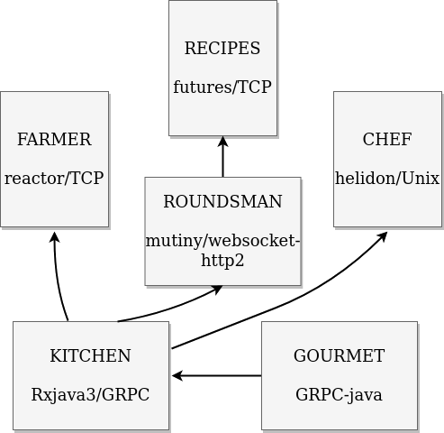

# Message-Streams/RSocket-JVM - GRPC interop example

This example demonstrates how RSocket-RPC services from [jauntsdn/RSocket-JVM](https://github.com/jauntsdn/rsocket-jvm) 
interoperate with each other over multiple transports & GRPC. It also demonstrates how Message-Streams/RPC are decoupled 
from RSocket-JVM runtime (including transports, metrics, load estimators/circuit breakers).

RSocket-RPC is fast Message-Streams & Protobuf/codegen based remote procedure call system, compatible with GRPC.

Each service & its RPC client/server bindings have API of different vendor: CompletableFuture, smallrye-mutiny, reactor-project, helidon, rxjava3.

Example application is comprised of 5 RSocket-RPC services (RSocket-JVM runtimes are stripped on this branch),
and one GRPC-java client:    

* [Farmer](https://github.com/jauntsdn/rsocket-jvm-interop-examples/blob/feature/oss/jaunt-rsocket-reactor-service/src/main/java/com/jauntsdn/rsocket/trisocket/farm/Main.java) service (jauntsdn/RSocket-RPC-reactor + TCP transport)

* [Recipes](https://github.com/jauntsdn/rsocket-jvm-interop-examples/blob/feature/oss/jaunt-rsocket-futures-service/src/main/java/com/jauntsdn/rsocket/trisocket/recipes/Main.java) service (jauntsdn/RSocket-RPC-futures + TCP transport)

* [Roundsman](https://github.com/jauntsdn/rsocket-jvm-interop-examples/blob/feature/oss/jaunt-rsocket-mutiny-service/src/main/java/com/jauntsdn/rsocket/trisocket/roundsman/Main.java) service (jauntsdn/RSocket-RPC-mutiny + WEBSOCKET-HTTP2 transport)

* [Chef](https://github.com/jauntsdn/rsocket-jvm-interop-examples/blob/feature/oss/jaunt-rsocket-helidon-service/src/main/java/com/jauntsdn/rsocket/trisocket/chef/Main.java) service (jauntsdn/RSocket-RPC-helidon + UNIX transport)
 
* [Kitchen](https://github.com/jauntsdn/rsocket-jvm-interop-examples/blob/feature/oss/jaunt-rsocket-rxjava-service/src/main/java/com/jauntsdn/rsocket/trisocket/kitchen/Main.java) service (jauntsdn/RSocket-RPC-rxjava + GRPC transport)

* [Gourmet](https://github.com/jauntsdn/rsocket-jvm-interop-examples/blob/feature/oss/grpc-client/src/main/java/com/jauntsdn/rsocket/trisocket/gourmet/Main.java) client (GRPC-java)

### Build

`./gradlew`

Regenerate RPC client/service stubs (linux, windows(x86) only)

`./gradlew clean build -PgenerateProto=true`

